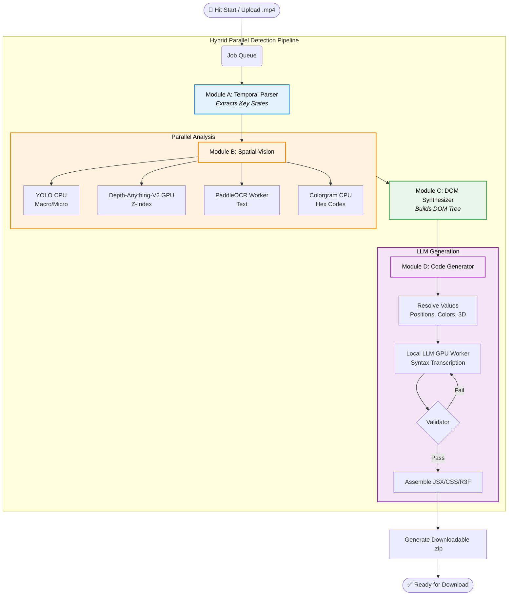

<div align="center">
  <h1>✨ OmniUI</h1>
  <p><b>Local, offline video-to-UI-code pipeline.</b></p>
</div>

<p align="center">
  Converts a screen recording of a 2D/3D interface into working React/HTML/CSS (and React Three Fiber for 3D) using deterministic computer vision for layout extraction — the local LLM is used strictly as a syntax compiler, never to guess pixel positions.
</p>

---

<h2 style="color: #4A90E2;">🎯 Current Status</h2>

*(Iteration 6 — hybrid parallel detection pipeline)*

| Module/Component | Status |
|---|---|
| **Core Orchestration** (FastAPI, async job queue) | ✅ Implemented |
| **VRAM Lifecycle Manager** (`vram_scope`, `GPUPipelineGuard`) | ✅ Implemented |
| **Module A** — Temporal Video Parser (OpenCV + SSIM + ambient motion) | ✅ Implemented |
| **Module B** — Hybrid Parallel Detection (YOLO CPU ∥ Vision LLM 3B + 7B verifier + PaddleOCR + Depth) | ✅ Implemented |
| **Module C** — DOM Synthesizer (auto 3D detection) | ✅ Implemented |
| **Module D** — Code Generation (runnable Vite+React scaffold) | ✅ Implemented |

---

<h2 style="color: #F5A623;">🔄 Workflow Architecture</h2>

When you hit "Start", the pipeline orchestrates a complete upload → queue → parse → detect → verify → nest → generate → download process:



---

<h2 style="color: #9013FE;">🧩 Modules in Detail</h2>

<details>
<summary><b>Module A: Temporal Parser</b> (Click to expand)</summary>

`app/modules/module_a_temporal_parser.py` reduces a recording to "key state" PNGs plus a best-effort cursor/action guess, using two SSIM comparisons per frame:

1. **Change-from-reference**: Is this frame different enough from the *last captured key state* to be a new one? Comparing against a persistent reference catches slow, gradual transitions (a fading modal, a slow drag).
2. **Stability-from-previous**: Has the video *stopped changing* frame-to-frame right now? Only once motion settles do we test the settled frame against the reference.

*Both checks run on a downscaled **color** SSIM proxy (not grayscale) so color-only UI changes aren't missed. Cursor position/action is a classical frame-differencing centroid over full-resolution grayscale frames.*
</details>

<details>
<summary><b>Module B: Spatial Vision</b> (Click to expand)</summary>

`app/modules/module_b_spatial_vision.py` runs four analyses per key-state image, one heavy model at a time via `GPUPipelineGuard`:

1. **Hybrid YOLO** (`ultralytics`): Macro-detector for containers, Micro-detector for elements inside crops.
2. **PaddleOCR**: Text region bounding boxes + recognized strings (via persistent subprocess).
3. **Depth-Anything-V2** (`transformers` pipeline): Per-pixel relative depth → `z_index`.
4. **Colorgram.py** (CPU): Dominant hex colors per element, from its crop.

*The VRAM gate spans two frameworks, not one. PaddleOCR is fully isolated into a persistent subprocess worker (`app.modules.ocr_subprocess_worker`), ensuring 100% VRAM cleanup.*
</details>

<details>
<summary><b>Module C: DOM Synthesizer</b> (Click to expand)</summary>

`app/modules/module_c_dom_synthesizer.py` takes Module B's flat list of `DetectedElement` and builds a parent-child `DOMNode` tree by spatial containment, then writes `state_N_layout.json` — the exact contract Module D consumes.

- **Containment uses an overlap ratio**: `intersection_area(A, B) / area(A) >= dom_containment_threshold` (default 0.8).
- **Tightest parent**: Each element's parent is the *tightest* enclosing element, requiring a parent candidate to have strictly greater area than the child. This makes the algorithm cycle-proof by construction.
- **Z-Order sorting**: Within a parent, children are sorted by `z_index` ascending (farthest first, nearest last).
</details>

<details>
<summary><b>Module D: Code Generator</b> (Click to expand)</summary>

`app/modules/module_d_code_generator.py` turns Module C's layout tree into React components, CSS, and (for 3D-flagged states) a React Three Fiber scene, using a local LLM running in an isolated subprocess.

- **Python resolves every value; the LLM only transcribes syntax**: Before any prompt is built, Python computes position/size, 3D projection, and color. The LLM's job is to transcribe this already-resolved tree into syntactically correct JSX/CSS/R3F.
- **Strict Verification**: Every generation is mechanically re-checked. `_validate_component` / `_validate_scene3d` confirm every node's class name appears, CSS blocks contain computed properties, and text content appears verbatim. A failed check retries automatically.
- **Isolated Generation**: By isolating generation into `llm_subprocess_worker.py`, the OS forcibly reclaims all VRAM the instant generation completes.
- **Per-state output**: Each key state gets its own component file (`State0.jsx`, `State1.jsx`, ...).
</details>

---

<h2 style="color: #7ED321;">🛠️ Setup & Installation</h2>

```bash
# 1. Create and activate virtual environment
python -m venv omniui_env
source omniui_env/bin/activate      # Windows: omniui_env\Scripts\activate

# 2. Install torch and paddlepaddle-gpu (CUDA-specific wheels) BEFORE requirements.txt:
pip install torch torchvision torchaudio --index-url https://download.pytorch.org/whl/cu121
pip install paddlepaddle-gpu -i https://www.paddlepaddle.org.cn/packages/stable/cu126/

# 3. Install remaining requirements
pip install -r requirements.txt
pip install -r requirements-dev.txt   # only needed to run tests

# 4. Copy environment variables template
cp .env.example .env   # adjust if needed
```

**Automated Setup**
```bash
setup.bat
```
> *This automatically sets up your `models_cache` and fully downloads all AI weights (including the 15GB Qwen2.5-Coder model) so the tool works 100% offline forever.*

---

<h2 style="color: #50E3C2;">▶️ Run & Try It</h2>

**Start the Server:**
```bash
./run.sh
# equivalent to: uvicorn app.main:app --reload
```
Interactive API docs: http://localhost:8000/docs (the easiest way to POST a video right now).

**Process a Video:**
```bash
# 1. Upload
curl -F "video=@your_ui_recording.mp4" http://localhost:8000/jobs

# 2. Check Status
curl http://localhost:8000/jobs/<job_id>

# 3. Download Result
curl -OJ http://localhost:8000/jobs/<job_id>/download
```
*With the models fully cached locally by `setup.bat`, the downloaded zip contains generated `State*.jsx` files, `styles.css`, `index.jsx`, and `package.json`.*

---

<h2 style="color: #D0021B;">🧪 Testing</h2>

```bash
pytest
```
56 unit/integration tests run without any GPU or external service. They use hand-built stand-ins for the pieces that genuinely need a GPU. A full pipeline integration pass wires the **real, unmodified** Module A and C together with Module B/D (faked only at the GPU points) and runs an actual synthetic video through `run_pipeline()` end to end.

---

<h2 style="color: #8B572A;">⚙️ Design Notes</h2>

- **Single-worker async queue**: Jobs run strictly one at a time because Module B/D's models can't safely share VRAM with a second job's models loaded concurrently.
- **`vram_scope()` / `GPUPipelineGuard`**: Guarantees the model is unloaded and `torch.cuda.empty_cache()` + `gc.collect()` run even if inference raises. 
- **Subprocess Isolation**: The LLM runs via `llm_subprocess_worker.py` ensuring 100% VRAM cleanup between generation stages.
- **Blocking Calls wrapped**: CPU-bound/GPU-bound stub functions are already dispatched through `asyncio.to_thread`.
- **Strongly-typed module contracts**: `KeyStateFrame` → `DetectedElement` → `LayoutState` flow between Modules A→B→C→D.

---

<h2 style="color: #4A4A4A;">🗺️ Roadmap</h2>

- [x] Module A — OpenCV capture + SSIM frame diffing + cursor tracking
- [x] Module B — YOLOv10 / PaddleOCR / Colorgram / Depth-Anything-V2 behind `GPUPipelineGuard`
- [x] Module C — containment-based DOM nesting algorithm
- [x] Module D — Local LLM subprocess + React/R3F code emission

**Remaining work (tuning and hardening):**
- A UI-fine-tuned YOLO checkpoint (e.g. trained on Rico) to replace the stock COCO weights.
- Module C's `is_3d_scene` detection needs Module B to pass through a pre-normalization depth statistic.
- TensorRT export for YOLOv10 + Depth-Anything-V2.
- Real end-to-end validation against actual model weights.
